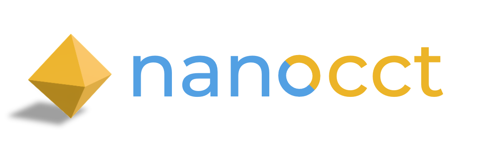

---

-  E X P E R I M E N T A L  -

---

# nanocct

Open Cascade bindings created with nanobind for the stable ABI of Python 3

## Overview

[Open Cascade Technology](https://github.com/Open-Cascade-SAS/OCCT) (OCCT) is the usual 3D CAD kernel for open source projects. nanocct makes OCCT 8 available to Python, class for class and method for method, so that code reads like the OCCT reference manual.

## A new approach

OCCT already has established Python bindings in [OCP](https://github.com/cadquery/OCP) and [pythonocc](https://github.com/tpaviot/pythonocc-core), and a whole ecosystem builds on them. nanocct takes a different route, started fresh with OCCT 8 and nanobind:

1. **One wheel per platform for every Python from 3.12 on.** The bindings are built with [nanobind](https://github.com/wjakob/nanobind) against the Python 3 stable ABI, so a single `cp312-abi3` wheel runs on 3.12, 3.13, 3.14 and later without a rebuild. [Design 4.1](Design.md#41-stable-abi)
2. **The OCCT reference manual is the documentation.** Names follow the OCCT headers by written rules, without renaming for Python taste, so the [Open Cascade reference manual](https://occt3d.com/dev/doc/refman/html/index.html) applies as it is, and OCCT's own `//!` comments are the docstrings. [Design 2a](Design.md#2a-naming-conventions)
3. **The OCCT 8 collection classes are Python generics.** `NCollection_IndexedDataMap[TCollection_AsciiString, TCollection_AsciiString]()` creates that instantiation, and `isinstance(x, NCollection_Array1)` holds for every array, whatever its element type. [Design 2a](Design.md#2a-naming-conventions), [6a](Design.md#6a-ncollection-containers-hand-written-binders)
4. **Out-parameters come back as results.** A C++ reference parameter that OCCT writes into is part of the Python return value: `curve, first, last = BRep_Tool.Curve_s(edge)`. [Design 2a](Design.md#2a-naming-conventions), [2b](Design.md#2b-parameter-conventions)
5. **Data exchange in memory.** An output stream is a returned `str` (`bytes` for binary formats), an input stream any file-like object: `BRepTools.Write_s(shape)` returns the BREP text, STEP and the OCAF documents work the same way. [Design 2b](Design.md#2b-parameter-conventions)
6. **Zero-copy access to OCCT's arrays.** Triangulation nodes, triangles, UVs and normals, the `NCollection` arrays and `Image_PixMap` are numpy views of OCCT's own memory, not copies. [Design 2c](Design.md#2c-python-additions)
7. **Type stubs in the package**, checked with mypy and ty as part of the test suite. [Design 6b](Design.md#6b-type-stubs)
8. **All of OCCT's visualization, without VTK.** The AIS interactive context, the V3d viewer and the OpenGL driver are bound. OCCT's VTK layer (`TKIVtk`) is the one part left out, on purpose: its classes derive from VTK's own C++ classes, so using it from Python needs VTK's Python wrappers, which are built for each Python version separately. That would give up point 1. [Design 2](Design.md#2-scope)
9. **Validated against real code.** The full test suites of [build123d](https://github.com/gumyr/build123d) (2 465 tests), ocpsvg, ocp_gordon and ocp_tessellate run on nanocct with the same outcome, test by test, as with the OCP bindings they were written for.
10. **AddOns, rarely.** A few C++ helpers where a Python loop over OCCT calls would dominate (tessellation), and workarounds for OCCT bugs that hit often and are not fixed upstream — each with a test that fails once OCCT fixes the bug, so it can be removed again. [Design 6](Design.md#6-binding-rules-11-and-the-documented-deviations) (R-ADDON)

<!-- TODO speed: per-call overhead and tessellation numbers, once the benchmarks are published in the repo -->

## A first look

```python
from nanocct.BRep import BRep_Tool
from nanocct.BRepMesh import BRepMesh_IncrementalMesh
from nanocct.BRepPrimAPI import BRepPrimAPI_MakeCylinder
from nanocct.BRepTools import BRepTools
from nanocct.TopAbs import TopAbs_ShapeEnum
from nanocct.TopExp import TopExp_Explorer
from nanocct.TopLoc import TopLoc_Location
import nanocct.TopoDS as TopoDS

shape = BRepPrimAPI_MakeCylinder(5.0, 10.0).Shape()
BRepMesh_IncrementalMesh(shape, 0.1)

for face in TopExp_Explorer(shape, TopAbs_ShapeEnum.TopAbs_FACE):
    mesh = BRep_Tool.Triangulation_s(TopoDS.Face(face), TopLoc_Location())
    nodes = mesh.NodesArray()                   # (N, 3) numpy view of OCCT's memory, no copy

edge = TopoDS.Edge(next(iter(TopExp_Explorer(shape, TopAbs_ShapeEnum.TopAbs_EDGE))))
curve, first, last = BRep_Tool.Curve_s(edge)    # out-parameters come back in the result
brep = BRepTools.Write_s(shape)                 # a BREP in memory, as str
```

## Status

- OCCT 8.0.1, 45 toolkits: FoundationClasses, ModelingData, ModelingAlgorithms, Visualization (without VTK), ApplicationFramework and DataExchange. [Design 2](Design.md#2-scope)
- Built and tested on macOS arm64, Linux x86_64 (`manylinux_2_28`) and Windows x64. The wheels bundle OCCT, FreeType and FreeImage; the only Python dependency is numpy.
- Not on PyPI yet (the distribution will be `nanocct`); build from source with the `Makefile`. [Design 7](Design.md#7-build-and-packaging)
- Porting from OCP: [Design 8b](Design.md#8b-porting-from-ocp-cadquery-ocp-to-nanocct)

## How to start with build123d on nanocct

Neither wheel is on PyPI yet: build them first (see [How to build nanocct](#how-to-build-nanocct)), they land in `dist/`.

### Use the OCP shim

The shim is a local test vehicle: a thin facade that maps OCP calls to nanocct calls, so build123d runs unchanged on top of nanocct. In an environment with build123d installed, install nanocct and the shim wheel from `dist/`:

```bash
uv pip install dist/nanocct-*.whl "dist/cadquery_ocp_novtk-8.0.1.0.0+shim-py3-none-any.whl"
```

The shim replaces the installed `cadquery-ocp-novtk` by itself; `uv pip list` shows it as `cadquery-ocp-novtk 8.0.1.0.0+shim`. build123d and ocp-tessellate then work as before — their full test suites pass through the shim with the same outcome, test by test, as with the original OCP bindings. The OCCT bug workarounds of nanocct's AddOns reach build123d only through nanocctbuild.

### Use nanocctbuild

```bash
make nanocctbuild
```

This downloads ocpsvg, ocp-gordon, ocp-tessellate and build123d from PyPI, patches them to use nanocct directly, and installs them with the nanocct wheel from `dist/` into a new Python 3.14 environment `_scratch/.venv` (an existing one there is replaced). Install ocp-vscode or ocp-viewer into it if you want to view objects built with build123d on top of nanocct.

## How to build nanocct

Prerequisites: `git`, `curl`, [uv](https://docs.astral.sh/uv/), CMake and Ninja; on macOS the Xcode command line tools, on Linux Docker (the build runs in a `manylinux_2_28` container), on Windows Git Bash and the Visual Studio Build Tools (MSVC). [Design 3](Design.md#3-toolchain-and-third-party-dependencies), [Design 7](Design.md#7-build-and-packaging)

- Clone the repo

    ```bash
    git clone https://github.com/bernhard-42/nanocct
    cd nanocct
    ```

- Create the Python environment the build uses (`.venv`)

    ```bash
    make env
    ```

- Build the dependencies OCCT 8.0.1, FreeType, FreeImage and RapidJSON

    ```bash
    make deps
    ```

- Build the bindings: generate, compile, stubs, pack and repair the wheel, test the repaired wheel in a fresh environment, and the shim's wheel -- both wheels into `dist/`

    ```bash
    make wheels
    ```

## License

nanocct's own code is Apache-2.0 ([LICENSE](LICENSE)). The wheels bundle OCCT (LGPL-2.1 with the OCCT exception), FreeType and FreeImage; [licenses/](licenses/README.md) and [NOTICE](NOTICE) say which terms apply and why.
